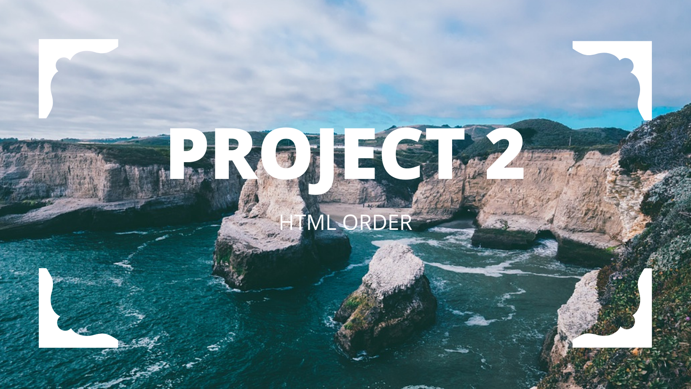
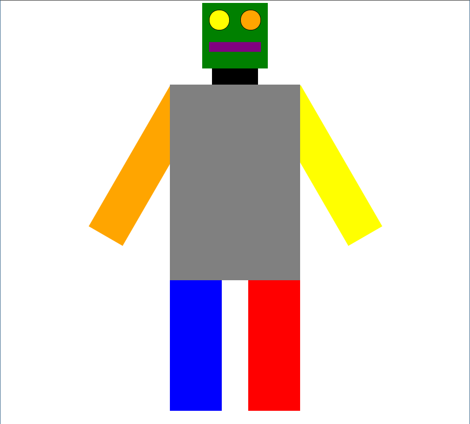

## Missing HTML



> Your goal is to make this image. Save the css below into a file called robot.css. Then make another called robot.html. Fill in the html so that your page looks like the image below. Include robot.css in your robot.html file.

```
#cont
{
	width: 600px;
	height: 1000px;
	position: relative;
	margin: auto;
}
.eye
{
	position: absolute;
	width: 60px;
	height: 60px;
	border-radius: 30px;
	border: black solid 1px;
}


#head
{
	width: 200px;
	height: 200px;
	background-color: green;
	position: relative;
	margin: auto;
}

#left_eye
{
	top: 20px;
	left: 20px;
	background-color: yellow;
}
#right_eye
{
	top: 20px;
	right:20px;
	background-color: orange;
}

#mouth
{
	width: 160px;
	height: 30px;
	background-color: purple;
	top: 120px;
	left: 20px;
	position: absolute;
}
#neck
{
	position: relative;
	width: 140px;
	height:50px;
	background-color: black;
	margin: auto;
}
#bulk_body
{
	position: relative;
	width: 400px;
	height: 600px;
	margin: auto;
	background-color: gray;
}
.leg
{
	width: 80px;
	height: 400px;
	position: absolute;
	padding-left: 40px;
	padding-right: 40px;
}
#right_leg
{
	background-color: red;
	right: 0px;
}
#left_leg
{
	background-color: blue;
	left: 0px;
}
#leg_container
{
	width:400px;
	height: 400px;
	position: relative;
	margin: auto;
}
.arm
{
	z-index: -1;
	width: 120px;
	height: 500px;
	position: absolute;
	top: -2px;
}
#left_arm
{
	left: -133px;
	background-color: orange;
	transform: rotate(30deg);
	-webkit-transform: rotate(30deg);
	-ms-transform: rotate(30deg);
}
#right_arm
{
	right: -133px;
	background-color: yellow;
	transform: rotate(-30deg);
	-webkit-transform: rotate(-30deg);
	-ms-transform: rotate(-30deg);
}
```
